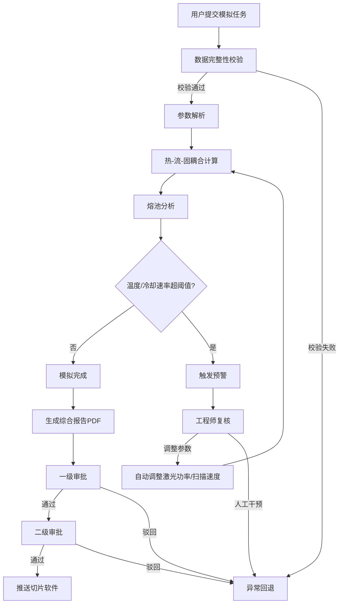
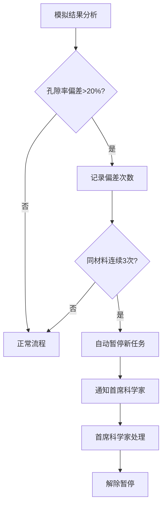

## 1. 产品概述

高精度粉末床熔融（PBF）增材制造熔池动力学模拟与工艺优化平台，面向增材制造工程师与科研人员，提供从参数输入、热-流-固耦合模拟、实时监控预警到工艺参数智能优化的全流程数字化解决方案。

- 解决增材制造过程中熔池行为预测困难、工艺参数依赖经验试错的核心痛点
- 目标用户：增材制造工程师、工艺科学家、质量控制人员；产品价值：缩短工艺开发周期50%+，降低缺陷率

## 2. 核心功能

### 2.1 用户角色

| 角色 | 注册方式 | 核心权限 |
|------|----------|----------|
| 模拟工程师 | 管理员分配账号 | 提交模拟任务、查看报告、接收预警 |
| 审批工程师 | 管理员分配账号 | 复核预警、一级审批、调整工艺参数 |
| 首席科学家 | 管理员分配账号 | 二级审批、处理孔隙率异常、查看全局看板 |
| 系统管理员 | 系统内置 | 用户管理、系统配置、阈值设定 |

### 2.2 功能模块

1. **模拟任务中心**：任务提交、参数上传、状态流转、任务列表
2. **实时监控台**：熔池温度曲线、冷却速率图表、阈值预警、工程师复核
3. **报告中心**：熔池形貌图、温度场分布、残余应力分布、PDF报告生成与下载
4. **工艺推荐引擎**：历史模拟分析、最优参数推荐、参数对比
5. **审批工作台**：两级审批流程、审批记录、推送切片软件
6. **预警中心**：阈值告警列表、工程师复核操作、自动调整策略
7. **数据看板**：每日模拟完成率统计、材料质量趋势、任务状态分布

### 2.3 页面详情

| 页面名称 | 模块名称 | 功能描述 |
|----------|----------|----------|
| 仪表盘 | 统计概览 | 显示今日/本周模拟完成率、运行中任务数、预警数、待审批数 |
| 仪表盘 | 任务状态分布 | 环形图展示各状态任务数量占比 |
| 仪表盘 | 材料质量趋势 | 折线图展示近期材料孔隙率偏差趋势 |
| 仪表盘 | 最近预警 | 列表展示最新5条预警信息及状态 |
| 模拟任务 | 新建任务 | 上传粉末材料文件、激光扫描路径、基板温度参数；自动校验数据完整性 |
| 模拟任务 | 任务列表 | 展示所有模拟任务及状态标签（待校验/参数解析/耦合计算/熔池分析/完成/异常回退） |
| 模拟任务 | 任务详情 | 查看任务完整信息、输入参数、状态流转时间线、关联预警 |
| 实时监控 | 温度曲线 | 实时渲染熔池温度随时间变化曲线，支持缩放和标注 |
| 实时监控 | 冷却速率 | 实时渲染冷却速率图表，标注安全阈值线 |
| 实时监控 | 预警面板 | 当前活跃预警列表，支持一键复核或忽略 |
| 报告中心 | 报告列表 | 展示已完成模拟的报告，支持PDF下载 |
| 报告中心 | 报告预览 | 在线预览熔池形貌、温度场热力图、残余应力分布图 |
| 工艺推荐 | 推荐列表 | 基于历史模拟推荐最优工艺参数组合 |
| 工艺推荐 | 参数对比 | 并排对比不同参数组合的模拟结果 |
| 审批工作台 | 待审批列表 | 一级/二级审批任务列表，显示关联模拟与推荐参数 |
| 审批工作台 | 审批操作 | 通过/驳回操作，填写审批意见，通过后自动推送切片软件 |
| 预警中心 | 预警列表 | 全部预警历史，按严重程度和时间排序 |
| 预警中心 | 复核操作 | 工程师复核预警，选择调整策略（调整激光功率/扫描速度/人工干预） |
| 预警中心 | 材料异常 | 同一材料连续三次孔隙率偏差超20%时高亮显示，展示暂停状态 |
| 数据看板 | 完成率统计 | 每日/每周/每月模拟完成率柱状图 |
| 数据看板 | 任务分布 | 按状态、材料类型的任务分布图 |

## 3. 核心流程

### 3.1 模拟任务全流程

用户提交模拟任务 → 系统校验数据完整性 → 参数解析阶段 → 热-流-固耦合计算（实时监控） → 熔池分析 → 检测温度/冷却速率是否超阈值 → 超阈值触发预警 → 工程师复核 → 复核通过则自动调整参数重新模拟 → 模拟完成生成报告 → 两级审批 → 推送切片软件生成打印指令

### 3.2 预警与复核流程

监控检测超阈值 → 生成预警记录 → 推送至工程师 → 工程师选择：调整激光功率 / 调整扫描速度 / 人工干预 → 调整后自动重新提交模拟

### 3.3 孔隙率异常流程

模拟结果孔隙率偏差计算 → 同一材料连续三次偏差超20% → 自动暂停该材料所有新任务 → 通知首席科学家 → 首席科学家审核处理 → 解除暂停

## 4. 用户界面设计

### 4.1 设计风格

- **主色调**：深空灰（#0D1117）为底色，电光蓝（#00D4FF）为主强调色，琥珀橙（#FF6B35）为预警色，翡翠绿（#00E5A0）为成功色
- **按钮风格**：微圆角（4px）、填充按钮与幽灵按钮搭配、悬停时边框发光效果
- **字体**：数据展示使用 JetBrains Mono 等宽字体，UI文案使用 Noto Sans SC 中文字体
- **布局风格**：左侧固定导航栏 + 顶部状态栏 + 主内容区域；卡片式模块布局，网格对齐
- **图标风格**：线性图标（Stroke 1.5px），科技感十足，辅以状态指示灯
- **整体风格**：工业控制室（Industrial Control Room）美学 — 深色背景、数据密集、发光边框、扫描线纹理

### 4.2 页面设计概览

| 页面名称 | 模块名称 | UI元素 |
|----------|----------|--------|
| 仪表盘 | 统计概览 | 4个统计卡片（深灰卡片+顶部发光边框），数字使用大号JetBrains Mono，趋势箭头 |
| 仪表盘 | 任务状态分布 | 环形图（电光蓝渐变），中心显示总数，图例在右侧 |
| 仪表盘 | 材料质量趋势 | 折线图（多色线条），琥珀橙标记超限点，网格背景 |
| 仪表盘 | 最近预警 | 列表卡片，左侧彩色状态条，预警等级标签，时间戳 |
| 模拟任务 | 新建任务 | 分步表单（3步：材料上传→路径配置→温度参数），拖拽上传区域带虚线边框 |
| 模拟任务 | 任务列表 | 表格布局，状态列使用彩色标签（胶囊形状），操作列带图标按钮 |
| 模拟任务 | 任务详情 | 左侧参数面板+右侧状态时间线（垂直时间线带节点发光） |
| 实时监控 | 温度曲线 | 大面积折线图，实时滚动，安全阈值区域半透明填充 |
| 实时监控 | 冷却速率 | 折线图+柱状图混合，阈值线为虚线+发光效果 |
| 实时监控 | 预警面板 | 右侧滑出面板，预警条目带闪烁指示灯 |
| 报告中心 | 报告列表 | 卡片网格，缩略图+基本信息，PDF下载按钮 |
| 报告中心 | 报告预览 | 全屏预览模式，左侧缩略图导航+右侧大图，底部工具栏 |
| 工艺推荐 | 推荐列表 | 卡片列表，参数组合表格+预期效果指标+置信度进度条 |
| 工艺推荐 | 参数对比 | 左右分栏对比，差异项高亮标注 |
| 审批工作台 | 待审批列表 | 列表+筛选器，审批状态标签，紧急度排序 |
| 审批工作台 | 审批操作 | 模态弹窗，通过/驳回按钮+意见文本框 |
| 预警中心 | 预警列表 | 列表+筛选器（级别/状态/时间），严重程度用颜色区分 |
| 预警中心 | 复核操作 | 展开式详情面板，策略选择按钮组+参数调整滑块 |
| 预警中心 | 材料异常 | 高亮警告横幅+材料详情卡片+暂停状态指示 |
| 数据看板 | 完成率统计 | 柱状图+趋势线，时间范围选择器 |
| 数据看板 | 任务分布 | 堆叠柱状图+饼图组合 |

### 4.3 响应式设计

- 桌面优先设计，最小支持1366px宽度
- 导航栏在平板设备折叠为图标模式
- 图表组件自适应容器宽度
- 表格在窄屏下支持横向滚动

### 4.4 3D场景指引

- 熔池形貌展示：使用Three.js渲染熔池3D形貌，金属质感材质，环境光遮蔽
- 温度场：热力图纹理映射到3D表面，冷色到暖色渐变
- 残余应力：等值面渲染，应力集中区域发光高亮
- 交互：支持旋转、缩放、剖面切割
