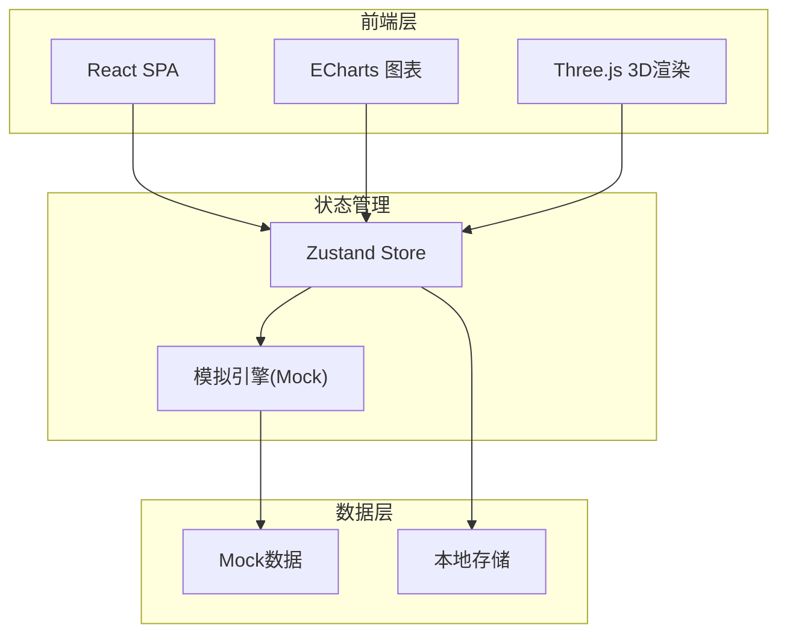
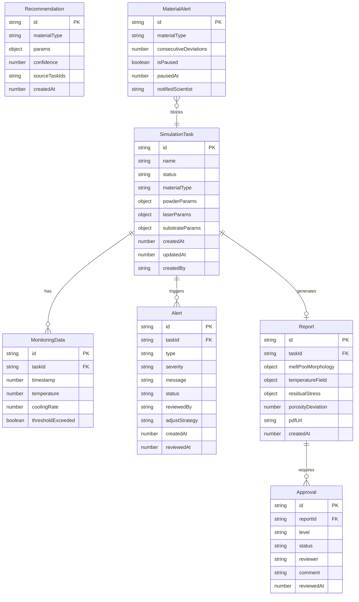
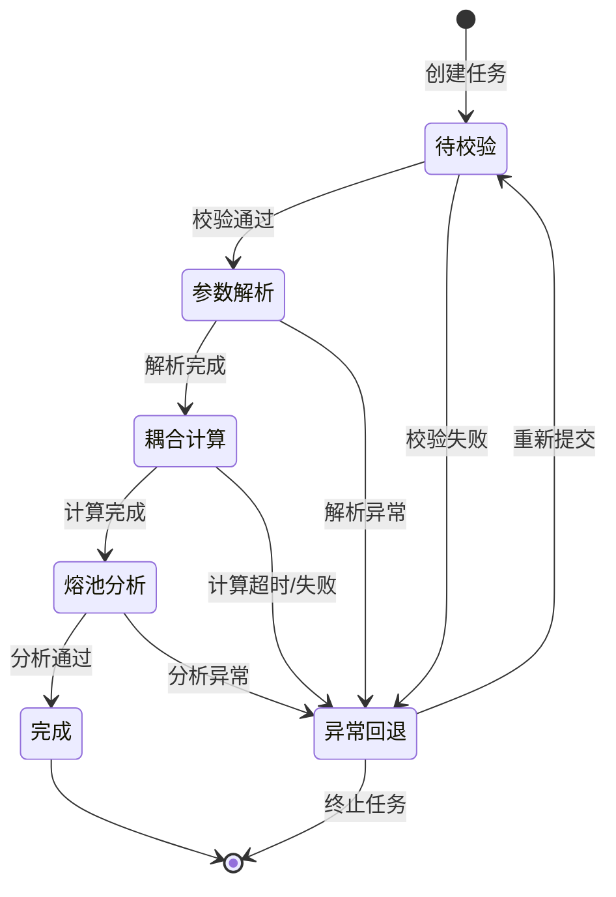

## 1. 架构设计



## 2. 技术说明

- **前端框架**：React@18 + TypeScript + Vite
- **样式方案**：Tailwind CSS@3 + CSS Modules（关键动画）
- **图表库**：ECharts@5（温度曲线、冷却速率、统计图表）
- **3D渲染**：Three.js + @react-three/fiber + @react-three/drei（熔池形貌、温度场、应力场）
- **状态管理**：Zustand（轻量级全局状态）
- **路由**：React Router@6
- **后端**：无独立后端，使用Mock数据模拟全部业务逻辑
- **数据持久化**：localStorage用于任务状态和审批记录持久化
- **PDF生成**：html2canvas + jsPDF（客户端生成报告PDF）

## 3. 路由定义

| 路由 | 用途 |
|------|------|
| / | 仪表盘 - 统计概览与看板 |
| /simulation | 模拟任务中心 - 任务列表 |
| /simulation/new | 新建模拟任务 |
| /simulation/:id | 任务详情 |
| /monitor | 实时监控台 |
| /reports | 报告中心 |
| /reports/:id | 报告预览 |
| /recommendation | 工艺推荐引擎 |
| /approval | 审批工作台 |
| /alerts | 预警中心 |
| /dashboard | 数据看板 |

## 4. 数据模型

### 4.1 数据模型定义



### 4.2 核心类型定义

```typescript
type TaskStatus = 
  | "pending_validation" 
  | "parsing" 
  | "coupling_calculation" 
  | "melt_pool_analysis" 
  | "completed" 
  | "error_rollback";

interface SimulationTask {
  id: string;
  name: string;
  status: TaskStatus;
  materialType: string;
  powderParams: {
    material: string;
    particleSize: number;
    layerThickness: number;
    packingDensity: number;
  };
  laserParams: {
    power: number;
    scanSpeed: number;
    hatchSpacing: number;
    scanStrategy: string;
  };
  substrateParams: {
    temperature: number;
    preheatingEnabled: boolean;
  };
  statusHistory: { status: TaskStatus; timestamp: number }[];
  createdAt: number;
  updatedAt: number;
  createdBy: string;
}

interface MonitoringData {
  id: string;
  taskId: string;
  timestamp: number;
  temperature: number;
  coolingRate: number;
  thresholdExceeded: boolean;
}

interface Alert {
  id: string;
  taskId: string;
  type: "temperature" | "cooling_rate" | "porosity";
  severity: "warning" | "critical";
  message: string;
  status: "pending" | "reviewing" | "adjusted" | "dismissed";
  reviewedBy?: string;
  adjustStrategy?: "laser_power" | "scan_speed" | "manual";
  createdAt: number;
  reviewedAt?: number;
}

interface Report {
  id: string;
  taskId: string;
  meltPoolMorphology: { width: number; depth: number; length: number };
  temperatureField: { maxTemp: number; avgTemp: number; gradient: number };
  residualStress: { maxStress: number; distribution: string };
  porosityDeviation: number;
  pdfUrl?: string;
  createdAt: number;
}

interface Approval {
  id: string;
  reportId: string;
  level: 1 | 2;
  status: "pending" | "approved" | "rejected";
  reviewer?: string;
  comment?: string;
  reviewedAt?: number;
}

interface Recommendation {
  id: string;
  materialType: string;
  params: {
    laserPower: number;
    scanSpeed: number;
    hatchSpacing: number;
    substrateTemp: number;
  };
  confidence: number;
  sourceTaskIds: string[];
  expectedResults: {
    porosity: number;
    residualStress: number;
    meltPoolWidth: number;
  };
  createdAt: number;
}

interface MaterialAlert {
  id: string;
  materialType: string;
  consecutiveDeviations: number;
  isPaused: boolean;
  pausedAt?: number;
  notifiedScientist?: string;
}

interface DailyStats {
  date: string;
  totalTasks: number;
  completedTasks: number;
  completionRate: number;
  alertsCount: number;
  avgPorosityDeviation: number;
}
```

## 5. 状态流转机制

模拟任务状态机采用有限状态机模式：



## 6. Mock模拟引擎设计

由于无真实后端，前端内置Mock模拟引擎：

- **任务状态推进**：使用定时器模拟状态自动流转（每3-5秒推进一个状态）
- **实时数据生成**：使用正弦函数+随机噪声生成温度和冷却速率曲线
- **预警触发**：当生成数据超过预设阈值时自动创建预警记录
- **报告生成**：任务完成时自动生成模拟报告数据
- **推荐引擎**：基于预定义规则和材料类型匹配推荐参数
- **孔隙率偏差**：模拟生成孔隙率数据，特定材料可配置连续超限
